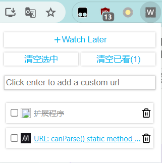

# Watch later chrome extension

## 功能

将当前页面添加到“稍后再看”列表中。虽然用收藏夹也能做到同样的事但还是造了个轮子。（已观看的页面置灰并删除线表示）

## 使用

1. 下载本项目的 dist 目录
2. 打开 chrome 插件开发者模式，加载 dist

## 开发
1. npm install
2. npm run dev
3. npm run build

## 学到的东西

**vite + vue 开发 chrome 插件**：除了需要在 public 目录下配置 manifest.json 用于 chrome 插件外，和普通项目开发完全没区别。插件的入口通过 `default_popup` 指定。

**LLM 直接上手撸**：某开发语言有基础，但是不熟悉基于该语言的框架，以往的做法可能是官方文档 Getting Start，现在可以直接描述自己的需求并询问 LLM how to do，可能还是会踩坑，但是排错效率相比看官方文档要高。不过这种方法的缺点是无法系统化学习框架的知识，所以这里记了个并没卵用的笔记自我感动下。